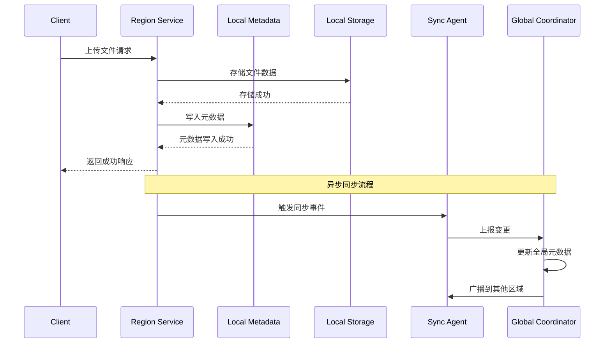
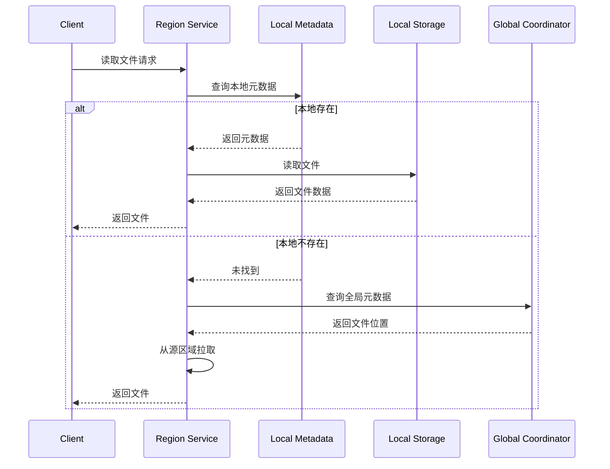

# JzSE 多区域协同文件服务系统架构概览

## 1. 系统愿景

JzSE (Jinzhao Storage Engine) 是一个从零设计的 **多区域协同文件服务系统**，核心目标是在分布式环境中实现：

- **本地高性能访问**：用户在本地区域内享受低延迟、高吞吐的文件操作体验
- **全局数据一致性**：跨区域数据在最终一致性模型下保持同步
- **区域自治**：各区域可独立运作，即使与其他区域断开连接也能继续服务

## 2. 设计原则

| 原则 | 描述 |
|------|------|
| **区域优先** | 读写请求优先在本地区域处理，减少跨区域延迟 |
| **异步同步** | 采用异步机制进行跨区域数据同步，不阻塞本地操作 |
| **最终一致性** | 接受短暂的数据不一致，换取更高的可用性和性能 |
| **故障隔离** | 单个区域的故障不影响其他区域的正常运行 |
| **可观测性** | 全面的日志、指标和追踪能力 |

## 3. 系统分层架构

```
┌─────────────────────────────────────────────────────────────────────────────┐
│                           客户端 (Clients)                                    │
│                    Web / CLI / SDK / 第三方应用                               │
└─────────────────────────────────────────────────────────────────────────────┘
                                     │
                                     ▼
┌─────────────────────────────────────────────────────────────────────────────┐
│                         API 网关层 (API Gateway)                             │
│                    请求路由 / 认证授权 / 限流熔断                              │
└─────────────────────────────────────────────────────────────────────────────┘
                                     │
          ┌──────────────────────────┼──────────────────────────┐
          ▼                          ▼                          ▼
┌─────────────────────┐   ┌─────────────────────┐   ┌─────────────────────┐
│   区域层 (Region)    │   │   区域层 (Region)    │   │   区域层 (Region)    │
│      Beijing        │   │      Shanghai       │   │      Shenzhen       │
│                     │   │                     │   │                     │
│ ┌─────────────────┐ │   │ ┌─────────────────┐ │   │ ┌─────────────────┐ │
│ │  Region Service │ │   │ │  Region Service │ │   │ │  Region Service │ │
│ └────────┬────────┘ │   │ └────────┬────────┘ │   │ └────────┬────────┘ │
│          │          │   │          │          │   │          │          │
│ ┌────────▼────────┐ │   │ ┌────────▼────────┐ │   │ ┌────────▼────────┐ │
│ │ Local Metadata  │ │   │ │ Local Metadata  │ │   │ │ Local Metadata  │ │
│ └────────┬────────┘ │   │ └────────┬────────┘ │   │ └────────┬────────┘ │
│          │          │   │          │          │   │          │          │
│ ┌────────▼────────┐ │   │ ┌────────▼────────┐ │   │ ┌────────▼────────┐ │
│ │ Local Storage   │ │   │ │ Local Storage   │ │   │ │ Local Storage   │ │
│ └─────────────────┘ │   │ └─────────────────┘ │   │ └─────────────────┘ │
└─────────┬───────────┘   └─────────┬───────────┘   └─────────┬───────────┘
          │                         │                         │
          └─────────────────────────┼─────────────────────────┘
                                    ▼
┌─────────────────────────────────────────────────────────────────────────────┐
│                    全局协调层 (Global Coordination Layer)                     │
│                                                                             │
│  ┌──────────────────┐  ┌──────────────────┐  ┌──────────────────┐          │
│  │ Global Metadata  │  │   Sync Engine    │  │ Conflict Resolver│          │
│  │     Manager      │  │                  │  │                  │          │
│  └──────────────────┘  └──────────────────┘  └──────────────────┘          │
│                                                                             │
│  ┌──────────────────┐  ┌──────────────────┐  ┌──────────────────┐          │
│  │  Region Registry │  │ Global Event Bus │  │  Audit & Logging │          │
│  │                  │  │                  │  │                  │          │
│  └──────────────────┘  └──────────────────┘  └──────────────────┘          │
└─────────────────────────────────────────────────────────────────────────────┘
                                    │
                                    ▼
┌─────────────────────────────────────────────────────────────────────────────┐
│                         持久化存储 (Persistent Storage)                       │
│                    分布式数据库 / 对象存储 / 文件系统                           │
└─────────────────────────────────────────────────────────────────────────────┘
```

## 4. 核心组件

### 4.1 区域层 (Region Layer)

部署在每个地理区域，是系统的"四肢"，直接服务本地用户：

| 组件 | 职责 |
|------|------|
| **Region Service** | 处理本地读写请求，提供文件上传/下载/删除等API |
| **Local Metadata** | 管理本地文件元数据（文件名、大小、权限、版本等）|
| **Local Storage** | 实际的文件存储，可对接本地磁盘或对象存储 |
| **Sync Agent** | 与全局协调层通信，执行同步任务 |

### 4.2 全局协调层 (Global Coordination Layer)

部署在核心数据中心，是系统的"大脑"：

| 组件 | 职责 |
|------|------|
| **Global Metadata Manager** | 维护全局元数据视图，文件的权威来源 |
| **Sync Engine** | 协调跨区域数据同步，管理同步队列和优先级 |
| **Conflict Resolver** | 检测和解决并发写入冲突 |
| **Region Registry** | 管理区域注册、健康检查、容量规划 |
| **Global Event Bus** | 区域间事件通知和订阅 |

## 5. 数据流

### 5.1 写入流程



### 5.2 读取流程



## 6. 一致性模型

系统采用 **最终一致性 (Eventual Consistency)** 模型：

- **本地强一致**：同一区域内的读写操作保证强一致性
- **全局最终一致**：跨区域的数据最终会达到一致状态
- **冲突解决策略**：
  - **Last-Writer-Wins (LWW)**：默认策略，基于向量时钟
  - **Custom Merge**：可选的自定义合并策略

## 7. 可扩展性设计

- **水平扩展**：区域层可独立扩展，增加更多区域
- **垂直扩展**：单区域内可增加更多节点处理能力
- **存储扩展**：支持多种存储后端（本地磁盘、S3、MinIO等）

## 8. 相关文档

- [技术选型](./tech-stack.md)
- [区域层设计](./region-layer.md)
- [全局协调层设计](./global-layer.md)
- [同步机制设计](./sync-mechanism.md)
